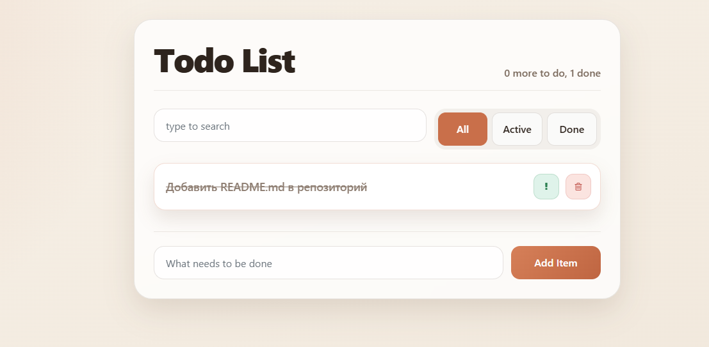

# Todo List

Небольшое учебное приложение для управления списком задач.

Проект сделан в рамках погружения в TypeScript и практики на типизации компонентов, пропсов, событий и состояния в React.

## Demo

- Live demo: https://ganeevandrej.github.io/Todo-list/

## Preview



## Что реализовано

- добавление новых задач
- удаление задач
- переключение статуса `done`
- переключение флага `important`
- поиск по названию задачи
- фильтрация задач по статусу: `all`, `active`, `done`
- отображение пустого состояния, когда список задач пуст

## Стек

- React 18
- TypeScript 4.9
- Create React App
- Bootstrap 4 для базовой стилизации
- Font Awesome для иконок
- GitHub Actions + GitHub Pages для деплоя

## Структура проекта

```text
src/
  components/
    app/
    app-header/
    empty-todo-list/
    item-add-form/
    item-status-filter/
    search-panel/
    todo-list/
    todo-list-item/
  services/
    types/
    utils/
```

## Запуск проекта

```bash
npm install
npm start
```

Приложение будет доступно по адресу `http://localhost:3000`.

## Доступные команды

```bash
npm start
npm run build
npm test
```
